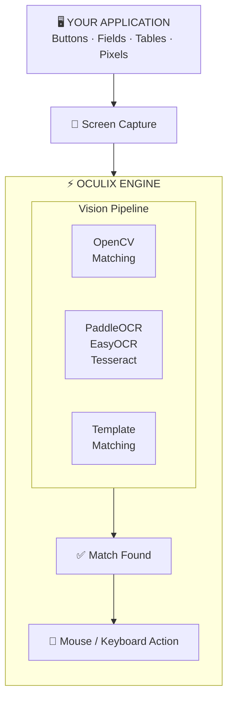

<div align="center">

# If you can see it, you can automate it.

[](https://github.com/oculix-org)
[](https://github.com/oculix-org)
<br>
[](https://github.com/oculix-org/SikuliX1)
[](https://github.com/oculix-org/Oculix)
[](https://github.com/oculix-org/SikuliX1/blob/master/LICENSE)

</div>

---

## 🎯 The Problem

Modern automation frameworks assume one thing: **structure**.

- Selenium → DOM  
- Playwright → Browser context  
- Appium → Accessibility tree  

But real-world systems don’t always give you that luxury.

> Legacy terminals.  
> Proprietary POS systems.  
> Mainframes.  
> Remote desktops over VNC.  
> Embedded devices with no API.  

**So what do you do when there’s nothing to hook into?**

You look at the screen.  
You see a button.  
You click it.

That’s exactly what we automate.

---

## 🧩 The Ecosystem

<table>
<tr>
<td width="50%" valign="top">

### 🔍 SikuliX1

The original visual automation engine.

- Image recognition powered by OpenCV  
- Multi-language scripting (Jython, JRuby, JavaScript)  
- Runs anywhere Java runs  

**Battle-tested for over a decade in production environments.**

[→ Repository](https://github.com/oculix-org/SikuliX1)  
[→ Releases](https://github.com/oculix-org/SikuliX1/releases)

</td>
<td width="50%" valign="top">

### ⚡ OculiX

The next generation of visual automation.

- Native VNC (no agent required)  
- Built-in SSH  
- ADB support (Android 12+)  
- Dual OCR: PaddleOCR + EasyOCR  
- Advanced text recognition beyond Tesseract  

Designed for modern, distributed, real-world environments.

[→ Repository](https://github.com/oculix-org/Oculix)  
[→ Releases](https://github.com/oculix-org/Oculix/releases)

</td>
</tr>
</table>

---

## ⚙️ How It Works



---

## 🚀 Quick Start

No installation. No setup. No dependencies beyond Java.

```bash
# Requires Java 17
java -jar oculixide-3.0.1-win.jar
java -jar oculixide-3.0.1-macos.jar
java -jar oculixide-3.0.1-lux.jar
```

Example script:

```python
click("login_button.png")
type("username", "admin")
type("password", "hunter2")
click("submit.png")
wait("dashboard.png", 10)
```

If it’s visible, it’s automatable.

---

## 🌍 Real-World Use Cases

| Industry | Typical Usage |
|----------|-------------|
| **Retail** | POS testing, self-checkout validation |
| **Banking** | Mainframe systems, ATM interfaces |
| **Healthcare** | Medical device UI validation |
| **Manufacturing** | SCADA / HMI automation |
| **Government** | Legacy system automation |
| **RPA** | UI automation without APIs |

---

## 📖 The Story
SikuliX started as an MIT research project in 2009.

Maintained for over a decade by Raimund Hocke aka [@RaiMan](https://github.com/RaiMan) — *the pope of visual automation* — it became a reference for RPA and non-web apps.

In 2026, the project entered a new phase and is now maintained under **oculix-org**.

OculiX builds on that foundation — designed for:

- Distributed systems  
- Remote execution (VNC / SSH)  
- Modern OCR requirements  
- Production-scale automation

**Same philosophy. New capabilities.**

---

## 💰 Pricing

SikuliX and OculiX are:

- Open source  
- MIT licensed  
- Free  

No usage limits. No hidden constraints.

Commercial offerings (IDE, support) may come later.  
The engine remains open.

---

## 🤝 Contributing

We welcome contributions.

- Bug reports  
- Feature requests  
- Pull requests  

If you rely on visual automation in production, your feedback matters.

---

## 🔗 Links & Documentation


**[SikuliX1](https://github.com/oculix-org/SikuliX1)** ·  
**[OculiX](https://github.com/oculix-org/Oculix)** ·  
**[Releases](https://github.com/oculix-org/Oculix/releases)**


### 📚 Original SikuliX Documentation

| Resource | Description |
|----------|-------------|
| [SikuliX GitBook](https://raimans-sikulix.gitbook.io/sikulix.com) | RaiMan's official overview and quickstart |
| [API Reference (ReadTheDocs)](https://sikulix-2014.readthedocs.io/en/latest/) | Full class documentation and usage guides |

**Core classes:**

| Class | Role |
|-------|------|
| [Region](https://sikulix-2014.readthedocs.io/en/latest/region.html) | Screen area — find, click, type, wait |
| [Screen](https://sikulix-2014.readthedocs.io/en/latest/screen.html) | Physical or remote display |
| [Match](https://sikulix-2014.readthedocs.io/en/latest/match.html) | Result of a find operation |
| [Pattern](https://sikulix-2014.readthedocs.io/en/latest/pattern.html) | Image + similarity + click offset |
| [Location](https://sikulix-2014.readthedocs.io/en/latest/location.html) | Single point (x, y) on screen |
| [Finder](https://sikulix-2014.readthedocs.io/en/latest/finder.html) | Iterator for multiple matches |
| [App](https://sikulix-2014.readthedocs.io/en/latest/appclass.html) | Application control (focus, open, close) |
| [OCR](https://sikulix-2014.readthedocs.io/en/latest/textandocr.html) | Text recognition and search |

[](https://sikulix-2014.readthedocs.io/en/latest/search.html)

---

## 💬 Final Note

Eggplant charges €50,000/year.

We don’t.

Because automation should not be gated behind enterprise pricing.  
And because if you can see it…  

You already know the rest.
