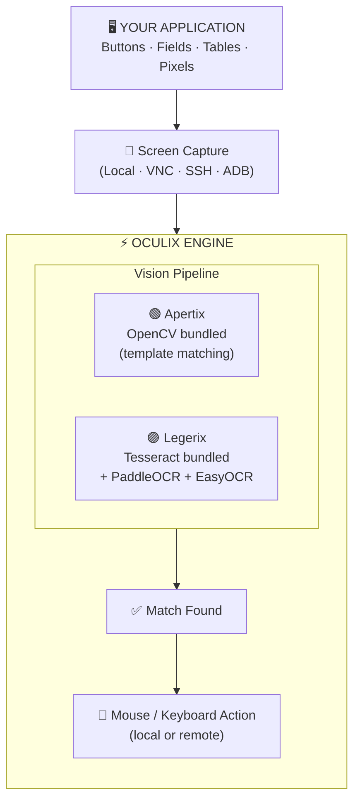

<div align="center">


# If you can see it, you can automate it.

[](https://github.com/oculix-org)
[](https://github.com/oculix-org)
[](https://github.com/oculix-org/Oculix/issues?q=label%3Ai18n-Languages)

<br>

[](https://github.com/oculix-org/SikuliX1)
[](https://github.com/oculix-org/Oculix)
[](https://github.com/oculix-org/Legerix)
[](https://github.com/oculix-org/Apertix)
[](https://github.com/oculix-org/Oculix/blob/master/LICENSE)

<br>

[](https://qa-julienmer-course.pages.dev/)

</div>

---

## 🎯 The Problem

Modern automation frameworks assume one thing: **structure**.

- Selenium → DOM
- Playwright → Browser context
- Appium → Accessibility tree

But real-world systems don't always give you that luxury.

> Legacy terminals.
> Proprietary POS systems.
> Mainframes.
> Remote desktops over VNC.
> Embedded devices with no API.

**So what do you do when there's nothing to hook into?**

You look at the screen.
You see a button.
You click it.

That's exactly what we automate.

---

## 🧩 The Ecosystem

A family of four open-source projects, each focused on one slice of visual automation.

<table>
<tr>
<td width="50%" valign="top">

### 🟡 SikuliX1
*The ancestor (2009 — MIT origin)*

The original visual automation engine that defined the category.

- Image recognition powered by OpenCV
- Multi-language scripting (Jython, JRuby, JavaScript)
- Battle-tested for 15+ years in production

[→ Repository](https://github.com/oculix-org/SikuliX1) · [→ Releases](https://github.com/oculix-org/SikuliX1/releases)

</td>
<td width="50%" valign="top">

### 🔵 OculiX
*The modern heir (2026 — active development)*

The next generation of visual automation.

- Native VNC (no agent required) · SSH · ADB (Android 12+)
- Dual OCR: PaddleOCR + EasyOCR + Tesseract via Legerix
- Refreshed IDE: Welcome tab, modern sidebar, 22 locales

[→ Repository](https://github.com/oculix-org/Oculix) · [→ Releases](https://github.com/oculix-org/Oculix/releases)

</td>
</tr>
<tr>
<td width="50%" valign="top">

### 🟣 Legerix
*The OCR sister*

Tesseract bundled cross-platform — no `apt install` required.

- Linux, macOS, Windows native binaries packaged
- Works in air-gapped environments
- Used by OculiX for its bundled OCR layer

[→ Repository](https://github.com/oculix-org/Legerix)

</td>
<td width="50%" valign="top">

### 🟢 Apertix
*The computer vision sister*

OpenCV bundled cross-platform — no manual install required.

- Linux, macOS, Windows native binaries packaged
- Apple Silicon (ARM64) supported
- Used by OculiX for its bundled CV layer

[→ Repository](https://github.com/oculix-org/Apertix)

</td>
</tr>
</table>

**Same DNA. Different focal points.** OculiX leads, Legerix reads, Apertix sees, SikuliX1 endures.

---

## ⚙️ How It Works


```mermaid
flowchart TD
    APP["🖥️ YOUR APPLICATION<br/>Buttons · Fields · Tables · Pixels"]
    CAPTURE["📸 Screen Capture<br/>(Local · VNC · SSH · ADB)"]

    APP --> CAPTURE

    subgraph ENGINE["⚡ OCULIX ENGINE"]
        direction TB

        subgraph VISION["Vision Pipeline"]
            direction LR
            CV["🟢 Apertix<br/>OpenCV bundled<br/>(template matching)"]
            OCR["🟣 Legerix<br/>Tesseract bundled<br/>+ PaddleOCR + EasyOCR"]
        end

        MATCH["✅ Match Found"]
        ACTION["🎯 Mouse / Keyboard Action<br/>(local or remote)"]

        VISION --> MATCH --> ACTION
    end

    CAPTURE --> ENGINE
```

---

## 🚀 Quick Start

No installation. No setup. No dependencies beyond Java.

```bash
# Requires Java 21+
java -jar oculixide-3.0.3-windows.jar
java -jar oculixide-3.0.3-macos.jar
java -jar oculixide-3.0.3-linux.jar
```

Example script:

```python
click("login_button.png")
type("username", "admin")
type("password", "hunter2")
click("submit.png")
wait("dashboard.png", 10)
```

If it's visible, it's automatable.

---

## 🌍 Real-World Use Cases

| Industry | Typical Usage |
|----------|-------------|
| **Retail** | POS testing, self-checkout validation |
| **Banking** | Mainframe systems, ATM interfaces |
| **Healthcare** | Medical device UI validation |
| **Manufacturing** | SCADA / HMI automation |
| **Government** | Legacy system automation |
| **RPA** | UI automation without APIs |
| **Gaming QA** | Visual regression on game UI |

---

## 🌐 An International Community

OculiX is being shaped by contributors from 5 continents in real time:

- 🇩🇪 [@RaiMan](https://github.com/RaiMan) — original SikuliX maintainer · German native review
- 🇧🇷 [@issaojr](https://github.com/issaojr) — pt_BR native review
- 🇨🇳 [@peixuana](https://github.com/peixuana) — zh_CN native review
- 🇹🇼 [@tcc](https://github.com/tcc) — zh_TW native review
- 🇮🇳 [@nishantsir57](https://github.com/nishantsir57) — macOS Accessibility fix
- 🇺🇸 [@adriancostin6](https://github.com/adriancostin6) — bug reports + PR fixes
- 🇰🇪 [@kelvinkirima014](https://github.com/kelvinkirima014) — foundational EDT fix

**22 locales open for native review** under the [`i18n-Languages`](https://github.com/oculix-org/Oculix/issues?q=label%3Ai18n-Languages) label — yours is probably listed. Showing up matters.

---

## 📖 The Story

SikuliX started as an MIT research project in 2009.

Maintained for over a decade by Raimund Hocke aka [@RaiMan](https://github.com/RaiMan) — *the pope of visual automation* — it became a reference for RPA, QA testing of non-web apps, and legacy system automation.

In **early March 2026**, the project entered a new phase. It is now maintained under **oculix-org** with @RaiMan's blessing and continued contributions (his commits land in the OculiX branches alongside the new maintainers).

OculiX builds on that foundation — designed for:

- Distributed systems
- Remote execution (VNC / SSH / ADB)
- Modern OCR requirements
- Production-scale automation
- Self-contained native libs (Legerix + Apertix replace `apt install` ceremonies)

**Same philosophy. New capabilities. Active transmission.**

---

## 💰 Pricing

All four projects (SikuliX1, OculiX, Legerix, Apertix) are:

- ✅ Open source under **MIT**
- ✅ Free — no usage limits, no premium tier, no paywall
- ✅ No telemetry, no AI calls home, no analytics phone-back
- ✅ No "Pro" version planned, no "Enterprise" tier on the roadmap

The engines, the bundled native libs, and the IDE — all open, all free, forever.

Reputation > revenue. That's the entire business model.

---

## 🤝 Contributing

We welcome:

- 🐛 Bug reports
- ✨ Feature requests
- 🔀 Pull requests
- 🌍 Native language reviews (see `i18n-Languages` issues)
- 📸 Screenshot field reports of unexpected behavior

If you rely on visual automation in production, your feedback shapes the next release.

---

## 🔗 Links & Documentation

**Repositories:**
[SikuliX1](https://github.com/oculix-org/SikuliX1) · [OculiX](https://github.com/oculix-org/Oculix) · [Legerix](https://github.com/oculix-org/Legerix) · [Apertix](https://github.com/oculix-org/Apertix)

**Releases:** [OculiX latest](https://github.com/oculix-org/Oculix/releases/latest)

### 📚 Original SikuliX Documentation

| Resource | Description |
|----------|-------------|
| [SikuliX GitBook](https://raimans-sikulix.gitbook.io/sikulix.com) | RaiMan's official overview |
| [API Reference (ReadTheDocs)](https://sikulix-2014.readthedocs.io/en/latest/) | Full class documentation and usage guides |

**Core classes:**

| Class | Role |
|-------|------|
| [Region](https://sikulix-2014.readthedocs.io/en/latest/region.html) | Screen area — find, click, type, wait |
| [Screen](https://sikulix-2014.readthedocs.io/en/latest/screen.html) | Physical or remote display |
| [Match](https://sikulix-2014.readthedocs.io/en/latest/match.html) | Result of a find operation |
| [Pattern](https://sikulix-2014.readthedocs.io/en/latest/pattern.html) | Image + similarity + click offset |
| [Location](https://sikulix-2014.readthedocs.io/en/latest/location.html) | Single point (x, y) on screen |
| [Finder](https://sikulix-2014.readthedocs.io/en/latest/finder.html) | Iterator for multiple matches |
| [App](https://sikulix-2014.readthedocs.io/en/latest/appclass.html) | Application control (focus, open, close) |
| [OCR](https://sikulix-2014.readthedocs.io/en/latest/textandocr.html) | Text recognition and search |

[](https://sikulix-2014.readthedocs.io/en/latest/search.html)

---

## 💬 Final Note

For 15+ years, visual automation has been an underground discipline — used quietly in QA labs, mainframe shops, RPA pipelines, and accessibility tools. The technology that lets your code click what your eye sees should belong to everyone who needs it.

**Four projects. One eye. Zero asterisks.**

If you can see it, you can automate it. 🦎
